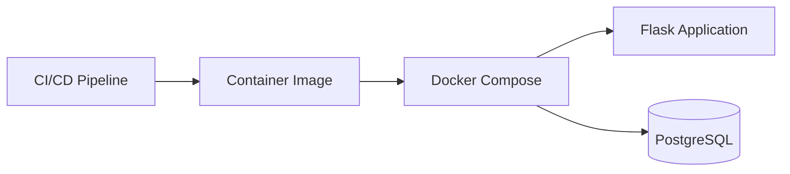

# Event Manager

## Introduction

This is a containerized Flask web application for creating and managing events.

## Architecture

A CI/CD Pipeline is used to create a container image containing the Flask web application. We use docker-compose to orchestrate the web container and the PostgreSQL container.

## Technology Stack

- Python
- Flask
- SQLAlchemy
- PostgreSQL
- Docker
- Docker Compose
- Pytest
- Alembic/Flask-Migrate
- KVM
- Kickstart