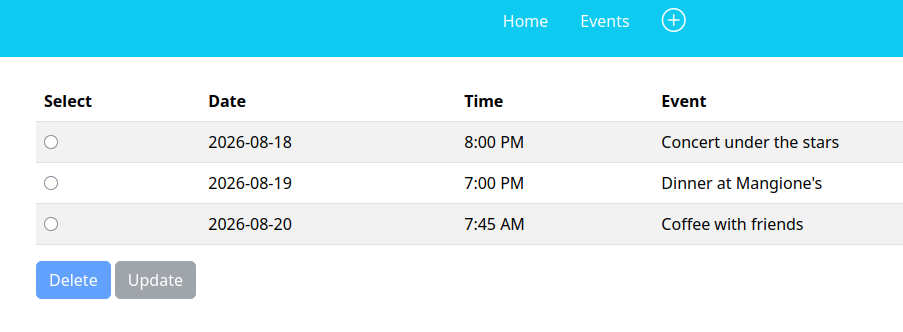
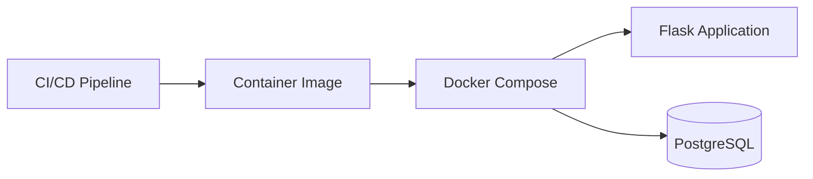
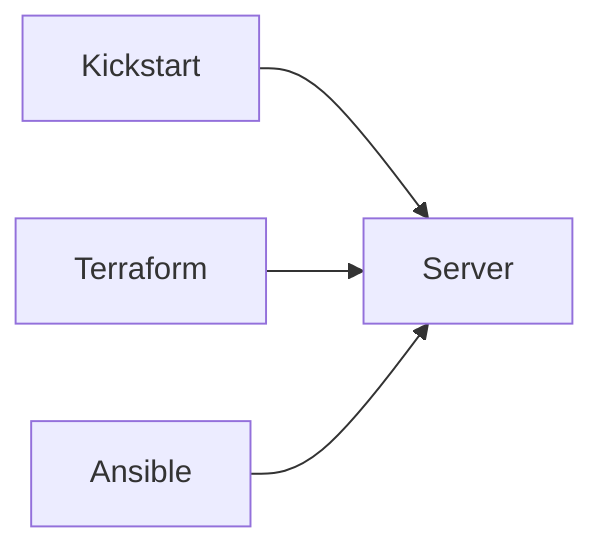
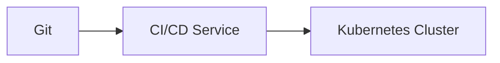

# CI/CD Flask Application

Here's a Python Flask task manager application.

So how do we deploy it? Manually? Nah...

## What is CI/CD

CI/CD is a practice where code gets committed, tested and deployed in a continuous loop. Containers are used to package components of the application as microservices, and these components are updated fequently through polling or commit hooks. 

To demonstrate CI/CD, this source repository takes a Python Flask application, packages it as a docker container, and deploys it to environments like VMs and cloud servers. Orchestrating multiple containers can become complicated due to numerous dependencies between them so we can use Docker Compose for a small, local dev/test environment.

But if we introduce virtual or physical servers running Docker, the task of provisioning and configuring these can be very time consuming and error prone. Tools such as Kickstart, Terraform and Ansible make these repetitive tasks easier.

Updating servers with the latest code in a continuous loop involves a CI/CD pipeline. With the pipeline in place, developers simply commit code to source repositories. The pipeline will take that code and push it to production.

Finally, if our application is a collection of microservices and requires scalabilty, fault tolerance, observability and high availability, we can to deploy it to a Kubernetes cluster. While Kubernetes is very popular as a production environment, it has a very high learning curve and maintenance overhead. Often dev/test teams may still prefer to deploy containers -- specific to their domain -- directly to VMs and servers. 

## Technology Stack

- Python
- Flask
- SQLAlchemy
- PostgreSQL
- Docker
- Docker Compose
- Pytest
- Alembic/Flask-Migrate
- KVM
- Kickstart