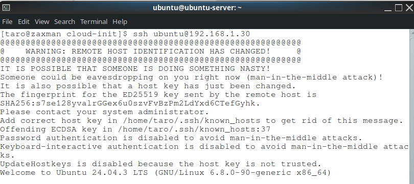

# Cloud-init

## Introduction

This script installs Ubuntu using KVM and cloud-init.

First install some packages to handle cloud-init. On ArchLinux, run the command below.

```sh
pacman -S cloud-init cloud-image-utils
```

You also need to install mkpasswd. This can be installed with the `whois` package.

Next, download the latest LTS cloud init image for Ubuntu 24, available from https://cloud-images.ubuntu.com/releases/ and move it to /data/libvirt/default/boot

```sh
sudo mv ubuntu-26.04-live-server-amd64.iso /data/libvirt/default/boot/
```

Create VMs using the script `create_seeded_ubuntu_vm.sh` which is a thin wrapper around virt-install to use cloud-init. For example:

```sh
sh ./create_seeded_ubuntu_vm.sh  -n ubuntu-server -i 192.168.1.30 -u ubuntu -p pass123 -s 20G
```

You can login with user `ubuntu`. The VM will already have your public key so there is no need to type in a password if using SSH. 