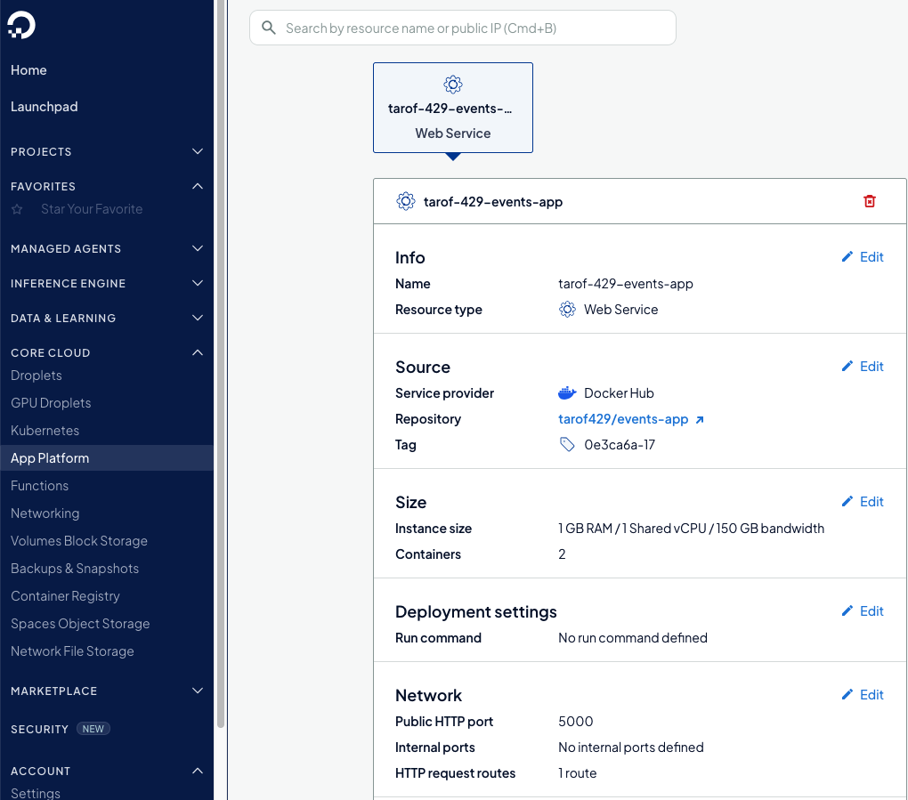
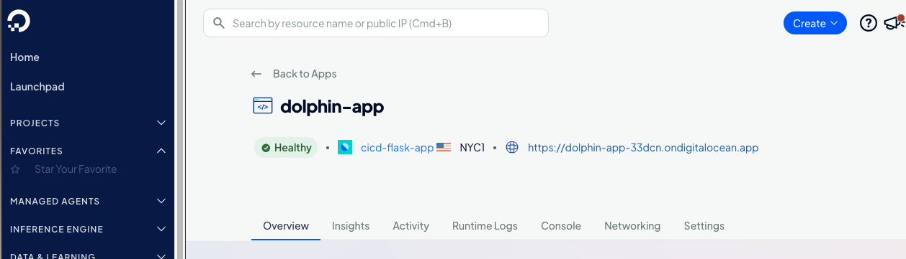

# Digital Ocean

## Introduction

Digital Ocean droplets can be used to run our CI/CD pipeline to deploy our Flask application. 

## Pre-requisites

Create 2 droplets with Ubuntu and 2GB RAM each; this can be done using the GUI. The droplets should be created in a nearby region.

## Steps for the Bash Pipeline

To configure the droplets we can use Ansible. See [Configuring Droplets](../ansible/README.md#configuring_droplets). For additional security, configure firewalls for the droplets, opening ports 22 and 5000 to each other and to ourselves.

Afterwards, see [Running the Bash pipeline in Digital Ocean](../bash/README.md#digital_ocean).

If desireable, configure an A record in a DNS service such as Route 53 to point to the IP of the droplet running the Flask application. If a reverse proxy isn't used, specify port 5000 after the domain in the URL. 

While working on deploying the application to Digital Ocean, a few things had to be fixed:

- Both application and the docker registry container were both using port 5000. Docker registry since has been changed to run on port 3000.
- The deploy script now explicitly pulls the image because it wasn't getting refreshed.

I find it convenient to create a simple script called *env.sh* with thse variables set:

```sh
export PRIVATE_REGISTRY_SERVER="<ip.of.cicd.server>"
export PRIVATE_REGISTRY_PORT="3000"
export DEPLOYMENT_SERVER="<ip.of.web.server>"
```

After sourcing this script, run *cicd-checklist.sh*. If this passes, then run *pipeline.sh*. 

Afterwards, you should be able to reach the application at *http://<ip.of.web.server>:5000* or *http://<route.53.record.name>:5000*.

To really test the pipeline, make a change in a route (such as /test), commit and push the changes. You can then curl the test page and it should contain the updated text.


## Managing Droplets

It can be handy to install *doctl* to manage droplets from the command-line. You will need to configure a PAT (personal access token) to use the CLI. Preferably, only assign the minimum scope needed to delete droplets.

To delete both droplets used by the bash pipeline, run:

```sh
{
 doctl compute droplet delete  cicd-server -f
 doctl compute droplet delete  web-server -f
}
```

## Steps for the Jenkins Pipeline

Similar to the steps needed to set up the bash pipeline, use Ansible to [configure droplets](../ansible/README.md#configuring_droplets). For additional security, configure firewalls for the droplets, opening ports 22 and 5000 to each other and to ourselves.

 Checkout this repository to the cicd-server and run [cicd-checklist.sh](../bash/cicd-checklist.sh). Common errors are:

 - JSON file used to configure insecure registries has an outdated IP
 - SSH key was not configured

Next, SSH to the cicd-server as admin. 

Build our custom image for Jenkins:

```sh
docker build -t myjenkins:a92b7-2 -f Dockerfile2 .
```

Bring up Jenkins:

```sh
DOCKER_GID="$(stat -c '%g' /var/run/docker.sock)" docker compose -f docker-compose2.yaml up -d 
```

Update the firewall and open port 8080 to my IP.

Get the admin password. For example:

```sh
docker exec -ti a430fbd48125 cat /var/jenkins_home/secrets/initialAdminPassword
 ```

 Once Jenkins is running, install the Jenkins SSH Agent plugin and docker pipeline plugin.

 Next, add the credentials for dockerhub and deployment-server-key.

 The SSH Agent Plugin can be tricky to get working. I recommend creating a simple pipeline and test whether you can SSH to another server using the following pipeline code:

 ```groovy
pipeline {
    agent any

    environment {
            DEPLOYMENT_SERVER = "<ip.of.server>"
            DEPLOYMENT_USER = "admin"
    }

    stages {
        stage ('Deploy') {
            steps {
                script {
                    sshagent(['deployment-server-key']) {
                        sh "ssh -o StrictHostKeyChecking=no ${DEPLOYMENT_USER}@${DEPLOYMENT_SERVER} ls"
                    }
                }
            }
        }
    }
}
 ```

## Using the App Platform

Let's back up a bit and look at an alternative way to run our docker container. Cloud platforms like Digital Ocean provide a serverless way of running docker images. This means we do not need to maintian a separate server to run our events application. Let's see how to do this.

First shutdown the application running on the deployment server droplet, getting the tag from the docker daemon.

```sh
 IMAGE_TAG=0e3ca6a-17 docker compose down
```

Let's try running just the docker container. We did this a long time ago before docker compose was introduced.

```sh
docker run -p 5000:5000 --name events-app tarof429/events-app:0e3ca6a-17
INFO  [alembic.runtime.migration] Context impl SQLiteImpl.
INFO  [alembic.runtime.migration] Will assume non-transactional DDL.
INFO  [alembic.runtime.migration] Running upgrade  -> a355d8372f18, Initial
 * Serving Flask app 'app.py'
 * Debug mode: on
WARNING: This is a development server. Do not use it in a production deployment. Use a production WSGI server instead.
 * Running on all addresses (0.0.0.0)
 * Running on http://127.0.0.1:5000
 * Running on http://172.17.0.2:5000
Press CTRL+C to quit
```

Remember this works because if we don't set the environment variable to anything, by default the application will use an embedded database.

To run the application with the embedded database in the App Platform, select App Platofrm, DockerHub, fill in the docker image and tag, and at the next screen adjust the port.



Afterwards we can navigate to the URL and access our app!



This is great. But it would be nice if we could add persistence.

## Using a managed database

What we need is a managed database. To add PostgreSQL, select Data & Learning, Managed Databses, create database cluster, and create a PostgreSQL database in a data center close to us, with the cheapest configuration and no auto-scaling. To use this database, copy the connection details, build the URI from it, and run the docker container. The following script can help!

```sh
#!/bin/bash

USERNAME="<redacted>"
PASSWORD="<redacted>"
HOST="<redacted>"
PORT="<redacted>"
DATABASE="<redacted>"
IMAGE_TAG="0e3ca6a-17"

DATABASE_URI=postgresql://${USERNAME}:${PASSWORD}@${HOST}:${PORT}/${DATABASE}?sslmode=require

docker run -d -p 5000:5000 --name events-app \
	-e "RUNTIME_MODE=prod" \
	-e "DATABASE_URI=${DATABASE_URI}" \
	tarof429/events-app:0e3ca6a-17
```

To run it:

```bash
IMAGE_TAG=0e3ca6a-17 bash ./run.sh
```

This information gives us powerful clues on how we can automate deployment of containers to use managed databases using our pipeline script.