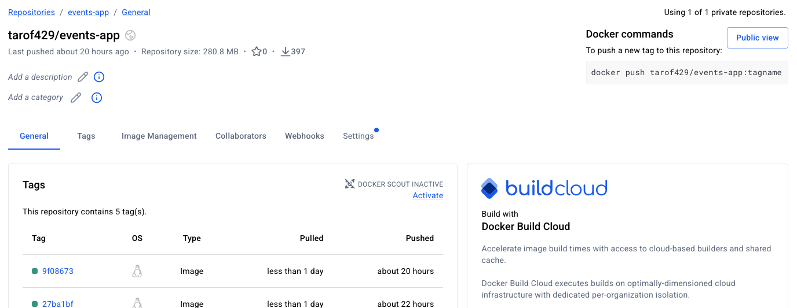

# Docker Registries

## Introduction

When we use Docker to publish (push) images, by default the docker client or CLI will publish to the public docker registry hosted by hub.docker.com. 



However, for various reasons we may want to publish to a private registry or to a registry hosted by a cloud service such as AWS. First, let's visit how images get pushed to hub.docker.com.

## Pushing to hub.docker.com

When we run the command:

```sh
docker tag events-app tarof429/events-app
```

We are specifying the repository *tarof429* on registry-1.docker.io, the actual registry hosted by hub.docker.com. 

If we wanted to explicitly push docker images to registry-1.docker.io, we could run:

```sh
docker login registry-1.docker.io
...
docker tag events-app:latest registry-1.docker.io/tarof429/events-app:latest
docker push registry-1.docker.io/tarof429/events-app:latest
```

A quick review of the docker images on hub.docker.com should show the new image.

If we wnated to push the image to a private registry, we would replace registry-1.docker.io with the IP or hostname of our registry and optionally the port.

## Using a private registry

Let's go through an exercise where we start a private registry on the Rocky VM (build server) and pull it from our Ubuntu VM.

On the build server, run:

```sh
docker run -d -p 5000:5000 --name registry registry:3
```

Next, build and tag the image.

```sh
docker build -f docker/Dockerfile -t localhost:5000/events-app:latest .
```

Push the image. It should be very fast!

```sh
docker push localhost:5000/events-app:latest 
```

If we try to pull the image from the Ubuntu VM, it will fail. This is because the registry is insecure.

```sh
docker pull 192.168.1.133:5000/events-app:latest 
Error response from daemon: failed to resolve reference "192.168.1.133:5000/events-app:latest": failed to do request: Head "https://192.168.1.133:5000/v2/events-app/manifests/latest": http: server gave HTTP response to HTTPS client
```

One simple solution is to allow the docker client to pull from insecure registries. To do this, we can add the following to /etc/docker/daemon.json to the Ubuntu server.

```yaml
{
    "insecure-registries" : [ "192.168.1.133:5000" ]
}
```

Restart the docker daemon and retry pulling the image. Now it should work.

```sh
 docker pull 192.168.1.133:5000/events-app:latest 
latest: Pulling from events-app
Digest: sha256:f6ca5dcece3d40661c04080289f3327958ec265d9c86b41eadc0806d0d5d01d7
Status: Downloaded newer image for 192.168.1.133:5000/events-app:latest
192.168.1.133:5000/events-app:latest
```

## Implications of using a private registry

If we wanted to use a private registry in our CI/CD pipeline, we will need to change how we tag, push and pull images. Additionally, if we wanted to use a secure private registry, we would need to decide how we want to manage certificates. Using an insecure registry is the simplest solution.

Altenatively, we could use AWS ECR, which is convenient if we have other infrastructure already in AWS. Dockerhub also offers paid plans that include unlimited private registries. These services come with a cost.

A private registry may actually be useful for storing images for testing or staging before being pushed to a public repository.

## Storage considerations

The container-based docker registry stores images within the container itself. Docker containers and images are stored under /var/lib/docker by default. We can poke around the file system and see how files are organized.

```sh
root@web-server:~# ls /var/lib/docker/
buildkit  containers  engine-id  image  network  plugins  rootfs  runtimes  swarm  tmp  volumes
root@web-server:~# ls /var/lib/docker/image/
identity-cache.db
root@web-server:~# ls /var/lib/docker/volumes/
578f875d4ff83860ad3e9e2bf6696f0cc66a881930dc5892148bd22bb771f30f  backingFsBlockDev
6485f2fc7faeed727b60e5f50c74fe19448b3be737b524e7eddcdaed6c512501  docker-compose_data
7a0344a669751f140f51907f1a77adff758546727664ebe22d65a9824a170c74  ea91a3a028a510dc4515ddbd1c1b8458b6283b61190433a76a409469080c1836
8b45cc3f15b60b3b11e08ed532038960134034dac15467ead66fd7b6e2755bd4  metadata.db
```

In our VM, having docker images under /var/lib/docker is a bit of a problem. This is because our kickstart script didn't allocate enough storage; eventually it will run out of disk space. Even if we don't have many images, system updates will surely reduce available disk space.

```sh
root@web-server:~# df -h
Filesystem           Size  Used Avail Use% Mounted on
/dev/mapper/rl-root  7.0G  4.0G  3.0G  58% /
devtmpfs             1.8G     0  1.8G   0% /dev
tmpfs                1.8G     0  1.8G   0% /dev/shm
tmpfs                731M  8.7M  722M   2% /run
tmpfs                1.0M     0  1.0M   0% /run/credentials/systemd-journald.service
/dev/vda5            2.0G  442M  1.6G  23% /boot
tmpfs                1.0M     0  1.0M   0% /run/credentials/serial-getty@ttyS0.service
tmpfs                1.0M     0  1.0M   0% /run/credentials/getty@tty1.service
tmpfs                366M  4.0K  366M   1% /run/user/0
```

When we look at the block devices there is actually a disk (/dev/vda4) that was formatted but never used.

```sh
root@web-server:~# lsblk -lf
NAME    FSTYPE      FSVER            LABEL                 UUID                                   FSAVAIL FSUSE% MOUNTPOINTS
sr0                                                                                                              
sr1     iso9660     Joliet Extension Rocky-10-2-x86_64-dvd 2026-05-25-20-58-20-00                                
vda                                                                                                              
vda1                                                                                                             
vda2    vfat        FAT16            EFI                   D779-42D2                                             
vda3    xfs                          BOOT                  ac0faa30-b59a-4f1b-a77b-90cc245d6507                  
vda4    xfs                          rocky                 01582c00-2b49-4e9b-86ee-75f418a4b720                  
vda5    xfs                                                b4f46a2f-b611-46e0-a451-ea7b712e1d64      1.5G    22% /boot
vda6    LVM2_member LVM2 001                               lGQSiT-6QJD-1XWQ-SQrL-QbCW-ZZ79-sRLiAD                
rl-root xfs                                                5889b368-293c-4366-997e-bb7f42c8e104        3G    57% /
rl-swap swap        1                                      8ad5b797-e7e1-4f31-b624-c2adfef09d06                  [SWAP]
```

There are a few options to consider.

1. Fix the kickstart script. We used *autopart* which apparently didn't do the best job.
2. Try to add the disk to to the logical volume. 
3. Mount /dev/vda4 somewhere like /data and use that to store imges.

The easiest option is to mount /dev/vda4 under a location such as /data. Then we could either:

- Configure docker daemon to use this location
- Tell the docker registry container to use this location as a volume mount or docker 


## Configuring docker daemon storage

First, let's mount the volume.

```sh
mkdir -p /data/docker
mount /dev/vda4 /data/
```

Below we can see the mounted volume.

```sh
root@web-server:~# df -h
Filesystem           Size  Used Avail Use% Mounted on
/dev/mapper/rl-root  7.0G  4.0G  3.0G  58% /
devtmpfs             1.8G     0  1.8G   0% /dev
tmpfs                1.8G     0  1.8G   0% /dev/shm
tmpfs                731M  8.7M  722M   2% /run
tmpfs                1.0M     0  1.0M   0% /run/credentials/systemd-journald.service
/dev/vda5            2.0G  442M  1.6G  23% /boot
tmpfs                1.0M     0  1.0M   0% /run/credentials/serial-getty@ttyS0.service
tmpfs                1.0M     0  1.0M   0% /run/credentials/getty@tty1.service
tmpfs                366M  4.0K  366M   1% /run/user/0
/dev/vda4            8.4G  980M  7.5G  12% /data
```

Edit /etc/docker/daemon.json so tht it says:

```sh
{
    "insecure-registries" : [ "192.168.1.133:5000" ],
    "data-root": "/data/docker",
    "storage-driver": "overlay2"
}
```

Restart docker daemon.

```sh
systemctl restart docker
```

Confirm the storage.

```sh
root@web-server:/# ls /data/docker/
buildkit  containers  engine-id  image  network  overlay2  plugins  runtimes  swarm  tmp  volumes
```

Also check the docker service. It's running!

```sh
root@web-server:/# systemctl status docker
● docker.service - Docker Application Container Engine
     Loaded: loaded (/usr/lib/systemd/system/docker.service; enabled; preset: disabled)
     Active: active (running) since Thu 2026-09-10 11:15:26 PDT; 1min 15s ago
 Invocation: 55f2b2685fd2464c8ffda945b7d41f12
TriggeredBy: ● docker.socket
       Docs: https://docs.docker.com
   Main PID: 3027 (dockerd)
      Tasks: 10
     Memory: 29.7M (peak: 33.7M)
        CPU: 183ms
     CGroup: /system.slice/docker.service
             └─3027 /usr/bin/dockerd -H fd:// --containerd=/run/containerd/containerd.sock

Sep 10 11:15:26 web-server dockerd[3027]: time="2026-09-10T11:15:26.045900449-07:00" level=info msg="Deleting nftables IPv4 rules" error="running nft: /dev/stdin:1:17-30: >
Sep 10 11:15:26 web-server dockerd[3027]: time="2026-09-10T11:15:26.055864522-07:00" level=info msg="Deleting nftables IPv6 rules" error="running nft: /dev/stdin:1:18-31: >
Sep 10 11:15:26 web-server dockerd[3027]: time="2026-09-10T11:15:26.322487033-07:00" level=info msg="Loading containers: done."
Sep 10 11:15:26 web-server dockerd[3027]: time="2026-09-10T11:15:26.330050039-07:00" level=info msg="Docker daemon" commit=6a43e3d containerd-snapshotter=false storage-dri>
Sep 10 11:15:26 web-server dockerd[3027]: time="2026-09-10T11:15:26.330100675-07:00" level=info msg="Initializing buildkit"
Sep 10 11:15:26 web-server dockerd[3027]: time="2026-09-10T11:15:26.330193621-07:00" level=warning msg="failed check for fsverity support" error="enable fsverity failed: i>
Sep 10 11:15:26 web-server dockerd[3027]: time="2026-09-10T11:15:26.384489432-07:00" level=info msg="Completed buildkit initialization"
Sep 10 11:15:26 web-server dockerd[3027]: time="2026-09-10T11:15:26.387677671-07:00" level=info msg="Daemon has completed initialization"
Sep 10 11:15:26 web-server dockerd[3027]: time="2026-09-10T11:15:26.387711486-07:00" level=info msg="API listen on /run/docker.sock"
Sep 10 11:15:26 web-server systemd[1]: Started docker.service - Docker Application Container Engine.
```

We actually lost all docker images and containers, but this is okay.

```sh
root@web-server:/# docker images
                                                                                                                                                        i Info →   U  In Use
IMAGE   ID             DISK USAGE   CONTENT SIZE   EXTRA
```

Now let's modify /etc/fstab.

```sh
UUID=5889b368-293c-4366-997e-bb7f42c8e104 /                       xfs     defaults        0 0
UUID=b4f46a2f-b611-46e0-a451-ea7b712e1d64 /boot                   xfs     defaults        0 0
UUID=8ad5b797-e7e1-4f31-b624-c2adfef09d06 none                    swap    defaults        0 0
UUID=01582c00-2b49-4e9b-86ee-75f418a4b720 /data                 xfs     defaults          0 2 
```

Let's test. Unmount /data.

```sh
root@web-server:/# umount /data
umount: /data: target is busy.
```

Oops. Let's stop docker daemon.

```sh
root@web-server:/# systemctl stop docker
Stopping 'docker.service', but its triggering units are still active:
docker.socket
```

Let's unmount /data again.

```sh
root@web-server:/# umount /data
```

Now we should be able to mount /data.

```sh
root@web-server:/# mount -a
mount: (hint) your fstab has been modified, but systemd still uses
       the old version; use 'systemctl daemon-reload' to reload.
```

Oops again. Let's reload.

```sh
root@web-server:/# systemctl daemon-reload
```

Now it works.

```sh
root@web-server:/# mount -a
root@web-server:/# df -h
Filesystem           Size  Used Avail Use% Mounted on
/dev/mapper/rl-root  7.0G  4.0G  3.0G  58% /
devtmpfs             1.8G     0  1.8G   0% /dev
tmpfs                1.8G     0  1.8G   0% /dev/shm
tmpfs                731M  8.7M  722M   2% /run
tmpfs                1.0M     0  1.0M   0% /run/credentials/systemd-journald.service
/dev/vda5            2.0G  442M  1.6G  23% /boot
tmpfs                1.0M     0  1.0M   0% /run/credentials/serial-getty@ttyS0.service
tmpfs                1.0M     0  1.0M   0% /run/credentials/getty@tty1.service
tmpfs                366M  4.0K  366M   1% /run/user/0
/dev/vda4            8.4G  197M  8.2G   3% /data
root@web-server:/# 
```

Now restart docker daemon.

```sh
root@web-server:/# systemctl start docker
```

Now if we run the pipeline script build_pipeline7.sh on web-server, we should see new images.

```sh
admin@web-server:~/cicd-flask-app/bash$ docker images
                                                                                                                                                        i Info →   U  In Use
IMAGE                                   ID             DISK USAGE   CONTENT SIZE   EXTRA
192.168.1.133:5000/events-app:9f08673   b08f4fd9e6b8        177MB             0B    U   
postgres:14.24-alpine3.23               3c9823023616        289MB             0B    U   
tarof429/events-app:9f08673             65fb9339d7ea        177MB             0B        
```

This is in contrast to what we had after we started to use the new storage location.

```sh
root@web-server:/# docker images
                                                                                                                                                        i Info →   U  In Use
IMAGE   ID             DISK USAGE   CONTENT SIZE   EXTRA
```

Disk storage is less of an issue than before.

```sh
admin@web-server:~/cicd-flask-app/bash$ df -h
Filesystem           Size  Used Avail Use% Mounted on
/dev/mapper/rl-root  7.0G  4.0G  3.0G  58% /
devtmpfs             1.8G     0  1.8G   0% /dev
tmpfs                1.8G     0  1.8G   0% /dev/shm
tmpfs                731M  8.7M  722M   2% /run
tmpfs                1.0M     0  1.0M   0% /run/credentials/systemd-journald.service
/dev/vda5            2.0G  442M  1.6G  23% /boot
tmpfs                1.0M     0  1.0M   0% /run/credentials/serial-getty@ttyS0.service
tmpfs                1.0M     0  1.0M   0% /run/credentials/getty@tty1.service
/dev/vda4            8.4G  799M  7.7G  10% /data
tmpfs                366M  4.0K  366M   1% /run/user/1000
```

Did we have to create a subdirectory under /data? No, but but it can be less of a hastle later in case we need to perform system maintenance on it.

## References

https://hub.docker.com/_/registry
https://distribution.github.io/distribution/
