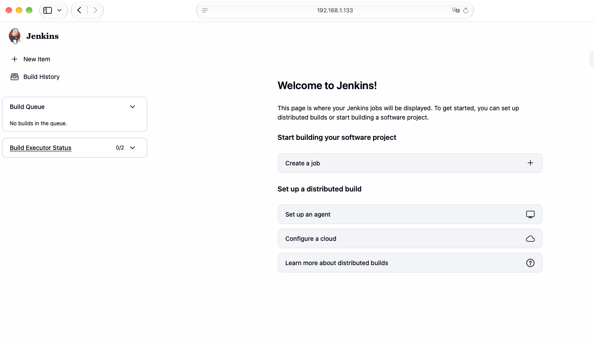
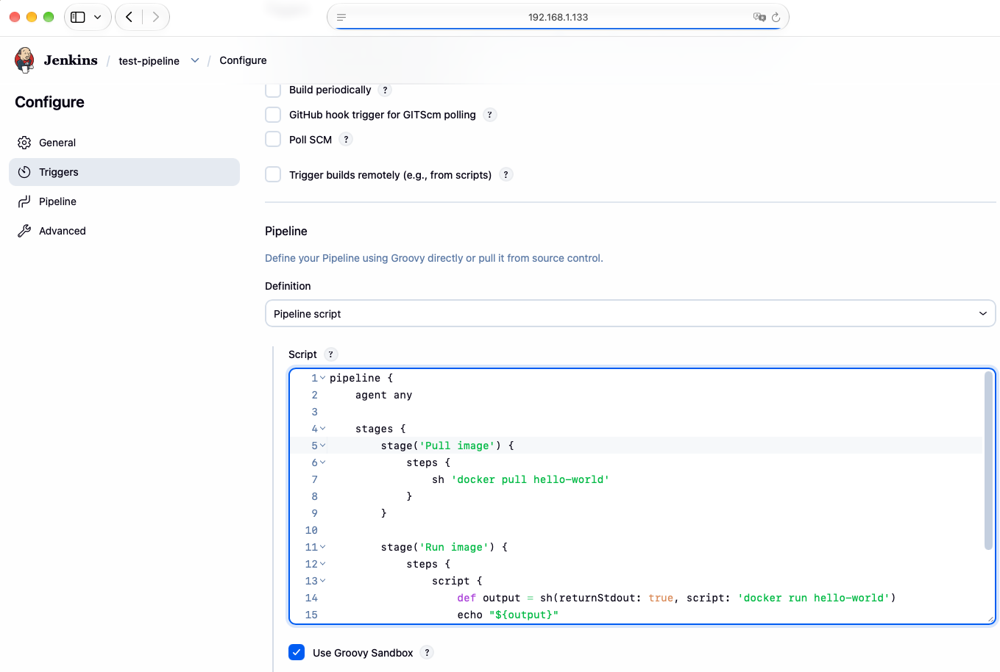
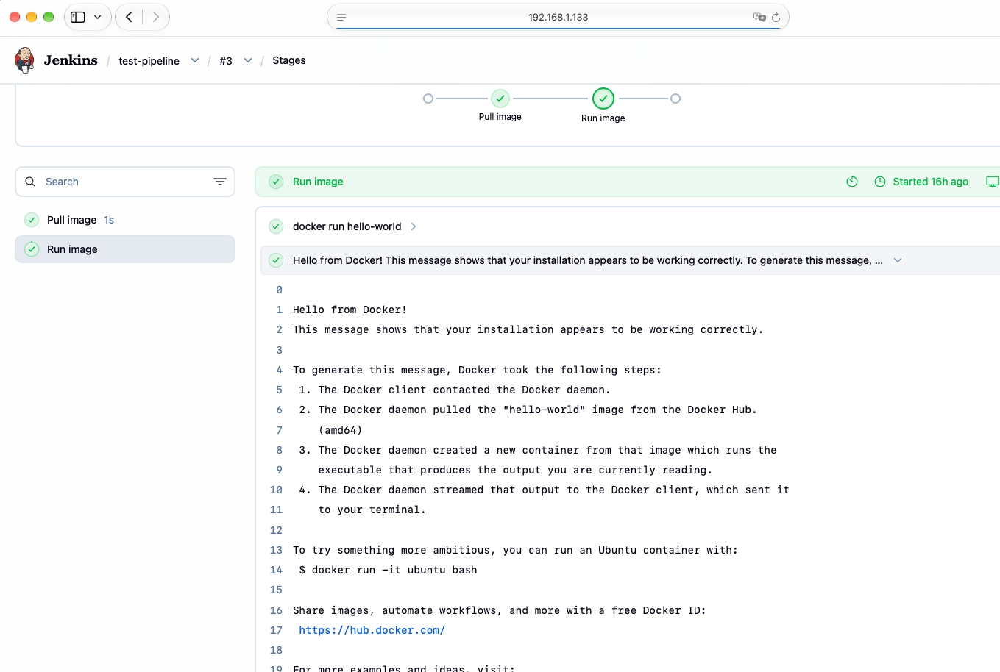

# Jenkins

## Introduction

Jenkins is a popular CI/CD server used to run CI/CD pipelines. It's not the most popular one, but it's one of the easiest to deploy. Also unlike other solutions like Gitlab or Git Actions, Jenkins is not tied to a specific source control management system (SCM). Because of this flexibility, Jenkins works very well in VMs that we manage or in cloud environments like Digital Ocean. We'll first look at how to run Jenkins in one of our KVM and gradually migrate our Bash pipeline to Jenkins-specific pipeline DSL. If there are any Droplets running in Digital Ocean, they can be terminated and recreated later to save on cost.

## Running Jenkins as a container

I've run Jenkins in different ways in the past: as a servlet container deployed to Tomcat, as a runnable war file, and finally as a docker container. The steps below show how to run Jenkins as a container.

### Pre-requisites

KVM running Rocky Linux. This is our *rocky_vm* in our Ansible inventory. Follow the steps to set up the KVM using Ansible so that Docker is installed.

### Steps

1. Run Jenkins and mount docker into the container:

    ```sh
    docker run -d -p 8080:8080 --name jenkins --restart=on-failure -v jenkins_home:/var/jenkins_home -v /var/run/docker.sock:/var/run/docker.sock jenkins/jenkins:lts
    ```

    It can be handy to put this in a shell script.

2. Login to the container as root.

    ```sh
    docker exec -ti -u 0 jenkins sh
    ```

3. Install docker so we have the docker CLI. Below is a quick way to install docker daemon.

    ```sh
    curl -fsSL https://get.docker.com -o get-docker.sh
    sh ./get-docker.sh
    ```

4. Change permission on our ArchLinux machine to /var/run/docker.sock to 666 so that Jenkins can manage docker images.

    ```sh
    chmod 666 /var/run/docker.sock
    ```

These steps will get you started. Afterwards, you can navigate to http://<ip.of.rocky.vm>:8000 using Safari (Firefox does not work with this URL) to confirm that Jenkins is running. 

However, since we know how to create our own Docker images, use Docker Compose and Docker volumes, I prefer an alternative method that takes care of some of the details for us.

1. Create our own docker image using the provided dockerfie. The tag is based on the git revision for Jenkins at this time.

```sh
docker build -t myjenkins:a92b7 .
```

2. Use docker-compose to bring up Jenkins. This is based on documentation found at https://github.com/jenkinsci/docker.

```sh
DOCKER_GID="$(stat -c '%g' /var/run/docker.sock)" docker compose up -d
```

ChatGPT suggested to add the following to the Docker compose file:

```sh
    group_add:
      - "${DOCKER_GID}"
```

This adds the group ID that can run docker on the host to the service user that runs Jenkins. It's a dynamic way of ensuring that the jenkins user in the container can talk to the Docker daemon.

3. Access Jenkins at http://<ip.of.rocky.vm>:8000.

4. Run the following to get the initial password:

```sh
 docker exec -ti <container.id.of.jenkins> cat /var/jenkins_home/secrets/initialAdminPassword
 ```

5. Install recommended plugins.

6. Create the admin user.

We should be all set!



One of the advantages of using docker compose to start the jenkins service with the docker GID is that we do not have to change permissions of /var/run/docker.sock on the host. This can be an advantage when rebooting the server (such as the result of patching). 

## Initial pipeline

After logging into Jenkins, we should create a simple pipeline to test that we can pull Docker images. The *Jenkinsfile-1* script does just that. An important element is the *script* block. Essentially, it allows us to execute arbitary Groovy code (such as defining variables) within a pipeline.

To use this pipeline, in Jenkins navigate to New Item | Pipeline, create a pipeline job, and paste in this script.



After running the pipeline successfully, go to Build | Pipeline overview. This screen shows a an overview of our pipeline by stages.



### Pipelines in detail

I think it's best to read the official docs at https://www.jenkins.io/doc/book/pipeline/ instead of trying to repeat what's alredy been said.