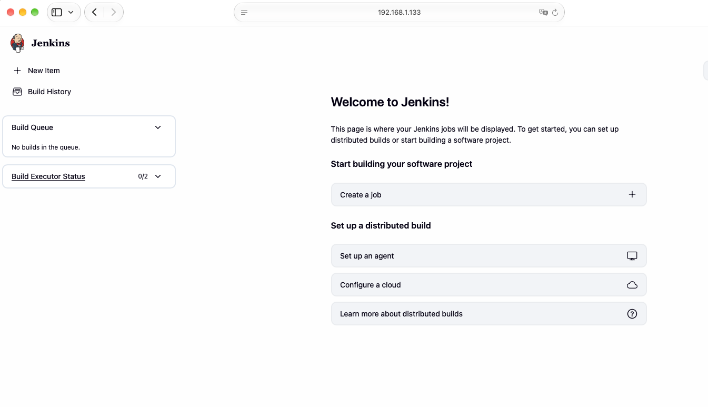
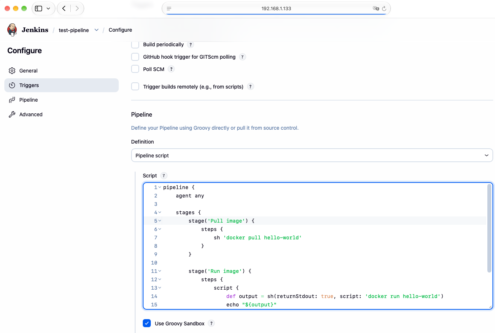
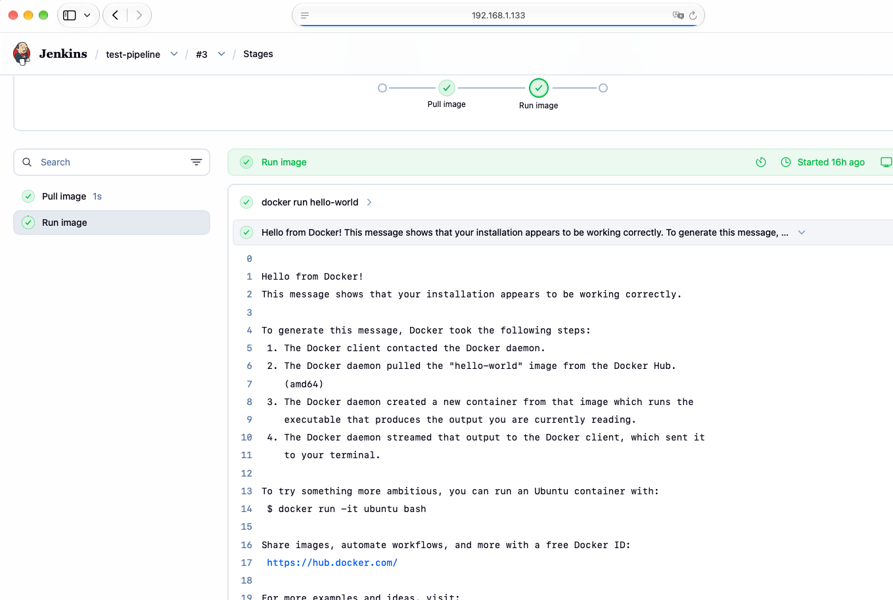
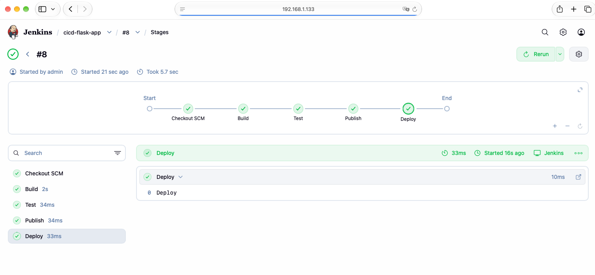
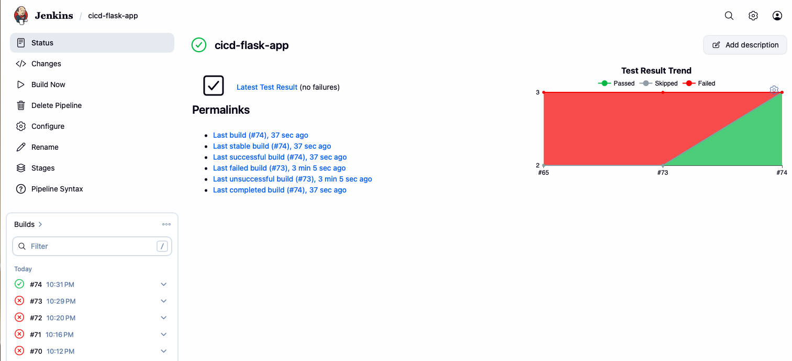
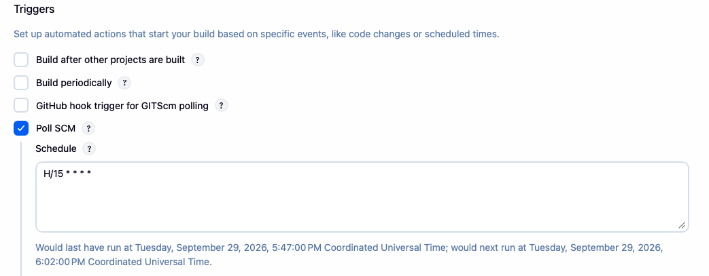
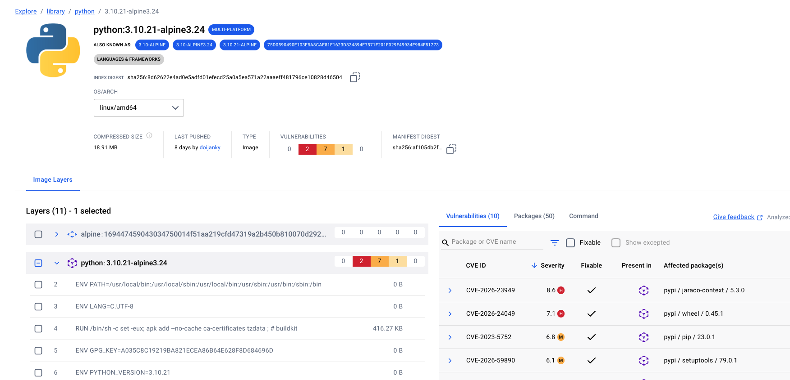
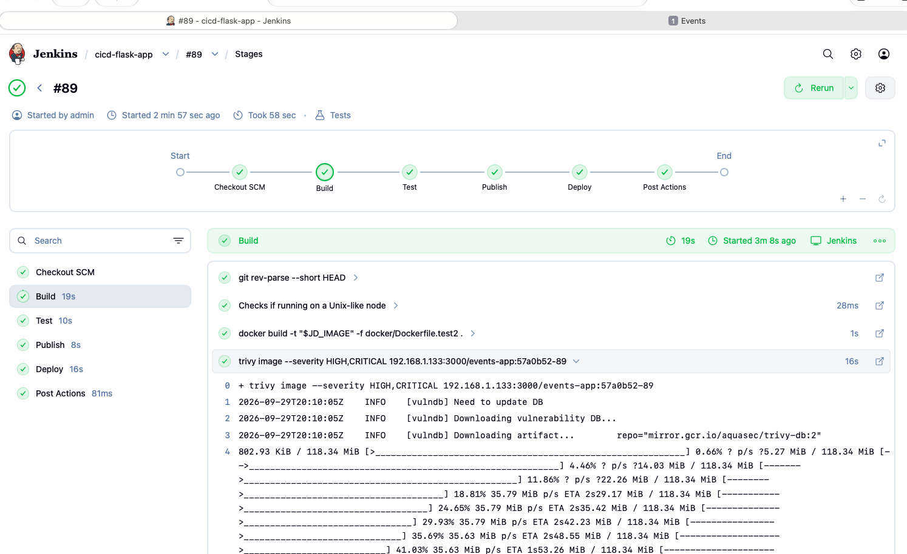

# Jenkins

## Introduction

Jenkins is a popular CI/CD server used to run CI/CD pipelines. It's not the most popular one, but it's one of the easiest to deploy. Also unlike other solutions like Gitlab or Git Actions, Jenkins is not tied to a specific source control management system (SCM). Because of this flexibility, Jenkins works very well in VMs that we manage or in cloud environments like Digital Ocean. We'll first look at how to run Jenkins in one of our KVM and gradually migrate our Bash pipeline to Jenkins-specific pipeline DSL. If there are any Droplets running in Digital Ocean, they can be terminated and recreated later to save on cost.

## Running Jenkins as a container

I've run Jenkins in different ways in the past: as a servlet container deployed to Tomcat, as a runnable war file, and finally as a docker container. The steps below show how to run Jenkins as a container.

### Pre-requisites

KVM running Rocky Linux. This is our *rocky_vm* in our Ansible inventory. Follow the steps to set up the KVM using Ansible so that Docker is installed.

### Steps

1. Run Jenkins and mount docker into the container:

    ```sh
    docker run -d -p 8080:8080 --name jenkins --restart=on-failure -v jenkins_home:/var/jenkins_home -v /var/run/docker.sock:/var/run/docker.sock jenkins/jenkins:lts
    ```

    It can be handy to put this in a shell script.

2. Login to the container as root.

    ```sh
    docker exec -ti -u 0 jenkins sh
    ```

3. Install docker so we have the docker CLI. Below is a quick way to install docker daemon.

    ```sh
    curl -fsSL https://get.docker.com -o get-docker.sh
    sh ./get-docker.sh
    ```

4. Change permission on our ArchLinux machine to /var/run/docker.sock to 666 so that Jenkins can manage docker images.

    ```sh
    chmod 666 /var/run/docker.sock
    ```

These steps will get you started. Afterwards, you can navigate to http://<ip.of.rocky.vm>:8000 using Safari (Firefox does not work with this URL) to confirm that Jenkins is running. 

However, since we know how to create our own Docker images, use Docker Compose and Docker volumes, I prefer an alternative method that takes care of some of the details for us.

1. Create our own docker image using the provided dockerfie. The tag is based on the git revision for Jenkins at this time.

```sh
docker build -t myjenkins:a92b7 .
```

2. Use docker-compose to bring up Jenkins. This is based on documentation found at https://github.com/jenkinsci/docker.

```sh
DOCKER_GID="$(stat -c '%g' /var/run/docker.sock)" docker compose up -d
```

ChatGPT suggested to add the following to the Docker compose file:

```sh
    group_add:
      - "${DOCKER_GID}"
```

This adds the group ID that can run docker on the host to the service user that runs Jenkins. It's a dynamic way of ensuring that the jenkins user in the container can talk to the Docker daemon.

3. Access Jenkins at http://<ip.of.rocky.vm>:8000.

4. Run the following to get the initial password:

```sh
 docker exec -ti <container.id.of.jenkins> cat /var/jenkins_home/secrets/initialAdminPassword
 ```

5. Install recommended plugins.

6. Create the admin user.

We should be all set!



One of the advantages of using docker compose to start the jenkins service with the docker GID is that we do not have to change permissions of /var/run/docker.sock on the host. This can be an advantage when rebooting the server (such as the result of patching). 

## Initial pipeline

After logging into Jenkins, we should create a simple pipeline to test that we can pull Docker images. The *Jenkinsfile-1* script does just that. An important element is the *script* block. Essentially, it allows us to execute arbitary Groovy code (such as defining variables) within a pipeline.

To use this pipeline, in Jenkins navigate to New Item | Pipeline, create a pipeline job, and paste in this script.



After running the pipeline successfully, go to Build | Pipeline overview. This screen shows a an overview of our pipeline by stages.



### Pipelines in detail

I think it's best to read the official docs at https://www.jenkins.io/doc/book/pipeline/ instead of trying to repeat what's alredy been said.

## Jenkinsfile with build stage

The *Jenkinsfile-2* script defines several stages that we indicated earlier in *pipeline.sh*. In this script, only the *build* stage is defined; we'll continue to flesh out more stages in subsequent scripts. 

Environment variables defined at the top are globally available to the script. An alternative syntax syntax is to prefix the variable with *env.*. 

Pushing images to our local docker registry doesn't require any credentials so a simple push statement should work. 

A successful run is shown below.



The *Jenkinsfile-3* script takes the previous script one step further and uses the docker pipeline plugin (which needs to be installed) to build and push the docker image. This plugin can help abstract some of the details of interacting with docker.

## Jenkinsfile with test stage

The *Jenkinsfile-4* script adds the test stage. Initially, the pipeline failed to run correctly. This is because our docker compose file expected COMMIT_HASH for the image tag, but our Jenkinsfile computes the tag as an aggregation of the commit hash plus the build number. Hence we make a new version of the docker compose file to align with our goals. Also we publish the test results to Jenkins. If we fix a broken test then we will see the trend directly in Jenkins.



Although pytest can generate HTML reports, I think it's better to generate XML reports and let Jenkins display it.

I had difficulty putting theory into practice. This is because both Jenkins *and* the tests are running as separate containers, so the problem was how to pass the test results, which are files, back to a location where Jenkins could find them. My solution was to store them in a docker volume called *test-reports*. When the tests are done, the pipeline uses a temporary container to copy those files back to the Jenkins container. Due to the complexity of this logic, I ended up writing *pipeline2.sh* which mirrors the Jenkins pipeline more closely and allowed me to troubleshoot issues found during development. Consuquently, I believe bash scripts are an excellent way to troubleshoot pipeline issues. 

## Jenkinsfile with the publish stage

The *Jenkinsfile-5* script adds the publish stage. We wrap the *push* in *withRegistry* block. This allows us to authenticate to Dockerhub using credentials stored in Jenkins. We also push the image using the *latest* tag to make it easy to grab the latest stable image.

## Jenkinsfile with the deploy stage

The *Jenkinsfile-6* script adds the deploy stage. I use the Jenkins SSH Agent plugin to copy files to the deployment server and run the deploy script. A few minor fixes were made to get this pipeline to work:

- The psycopg2-binary Python library was added to requirements.txt
- A new deploy2.sh which uses IMAGE_TAG was added

## Adding polling to the Jenkins job

Adding a trigger, such as periodically polling github for changes, will keep the application up to date on the deployment server.



## Container scanning with Trivy

Corporate security standards often require that container images running in a deployment environment need to be free of vulnerabilities, known as CVEs. While it's impossible for images to be completely safe, usually companies set a minimum threshold. Trivy is a free and open source scanner that can be used to scan our image.

Trivy can be installed in a variety of ways, but initially we'll install it directly on the deployment server. See https://trivy.dev/docs/latest/getting-started/installation/. 

The bash script *scan_with_trivy.sh* takes one parameter, the image tag. For example:

```sh
bash ./scan_wiith_trivy.sh  af0433a-87
```

At this time, the following was reported:

```sh
Python (python-pkg)

Total: 2 (HIGH: 2, CRITICAL: 0)

┌───────────────────────────┬────────────────┬──────────┬────────┬───────────────────┬───────────────┬──────────────────────────────────────────────────────────────┐
│          Library          │ Vulnerability  │ Severity │ Status │ Installed Version │ Fixed Version │                            Title                             │
├───────────────────────────┼────────────────┼──────────┼────────┼───────────────────┼───────────────┼──────────────────────────────────────────────────────────────┤
│ jaraco.context (METADATA) │ CVE-2026-23949 │ HIGH     │ fixed  │ 5.3.0             │ 6.1.0         │ jaraco.context: jaraco.context: Path traversal via malicious │
│                           │                │          │        │                   │               │ tar archives                                                 │
│                           │                │          │        │                   │               │ https://avd.aquasec.com/nvd/cve-2026-23949                   │
├───────────────────────────┼────────────────┤          │        ├───────────────────┼───────────────┼──────────────────────────────────────────────────────────────┤
│ wheel (METADATA)          │ CVE-2026-24049 │          │        │ 0.45.1            │ 0.46.2        │ wheel: wheel: Privilege Escalation or Arbitrary Code         │
│                           │                │          │        │                   │               │ Execution via malicious wheel file...                        │
│                           │                │          │        │                   │               │ https://avd.aquasec.com/nvd/cve-2026-24049                   │
└───────────────────────────┴───────
```

But interestingly, we do not use jaraco.context directly.

After some more investigation, I found that the vulnerability came from the base image.



Let's bulid a new docker image for Jenkins that contains trivy.

```sh
docker build -t myjenkins:a92b7-2 -f Dockerfile2 .
```

Bring it up (taking care to stop the old one first).

```sh
DOCKER_GID="$(stat -c '%g' /var/run/docker.sock)" docker compose -f docker-compose2.yaml up -d 
```

Confirm that trivy is now installed.

```sh
admin@web-server:~/cicd-flask-app/jenkins$ docker ps
CONTAINER ID   IMAGE               COMMAND                  CREATED          STATUS          PORTS                                                    NAMES
cd939294be64   myjenkins:a92b7-2   "/usr/bin/tini -- /u…"   16 seconds ago   Up 15 seconds   0.0.0.0:8080->8080/tcp, [::]:8080->8080/tcp, 50000/tcp   jenkins-jenkins-1
c13fdd123cbb   jenkins/ssh-agent   "setup-sshd"             16 seconds ago   Up 15 seconds   22/tcp                                                   jenkins-ssh-agent-1
79d17642ed83   registry:3          "/entrypoint.sh /etc…"   46 hours ago     Up 46 hours     0.0.0.0:3000->5000/tcp, [::]:3000->5000/tcp              registry
admin@web-server:~/cicd-flask-app/jenkins$ docker exec -ti cd939294be64 bash
jenkins@cd939294be64:/$ which trivy
/usr/local/bin/trivy
```

Run the build with *Jenkinsfile-7*. The scan works!

```sh
[Pipeline] }
[Pipeline] // withEnv
[Pipeline] sh
+ trivy image --severity HIGH,CRITICAL 192.168.1.133:3000/events-app:57a0b52-89
2026-09-29T20:10:05Z	INFO	[vulndb] Need to update DB
2026-09-29T20:10:05Z	INFO	[vulndb] Downloading vulnerability DB...
```

We intentionally don't fail the build, and rather let the build deploy as usual. We can see the trivy report in Jenkins' stage view.



This logic gives us a chance to fix vulnerabilities while keeping the deployment server up-to-date with the latest version of our application.

The pipeline script has been updated to move the trivy results to a file under the test-results subdirectory. It is also archived for easy access in the Jenkins UI.

## Removing old images

The *Jenkinsfile-8* script uses *at* to schedule removal old docker images. This helps to reduce disk usage on the deployment server. Why use *at*? Initially, I planned to run this command before the new image was brought up. Now it's a bit of legacy logic. Still, I find it interesting that cleanup tasks can be scheduled asynchronously, so the code is left as is.

*Jenkinsfile-9* extends the image cleanup to the webserver (the where Jenkins is running). Since we're inside the container we just delete the images immediately without scheduling.

## Conditional branch builds

The *Jenkinsfile-10* script introduces the idea of conditional stages. 

Now that the pipeline runs correctly in KVM, we can explore how it works in Digital Ocean. But to be safe and prevent accidental deployment, we work in a development branch. Even if changes are pushed to github, we'll skip the last two stages, *Publish* and *Deploy*, if the pipeline job is configured to only poll for the main branch. We can remove the condition once we are comfortable. 

Below is a diagram:

```sh
Environment  Branch     Push to Deployment Server
-----------  ------     ------------------------
KVM          Main       Yes
DO           feature/do  No
```

