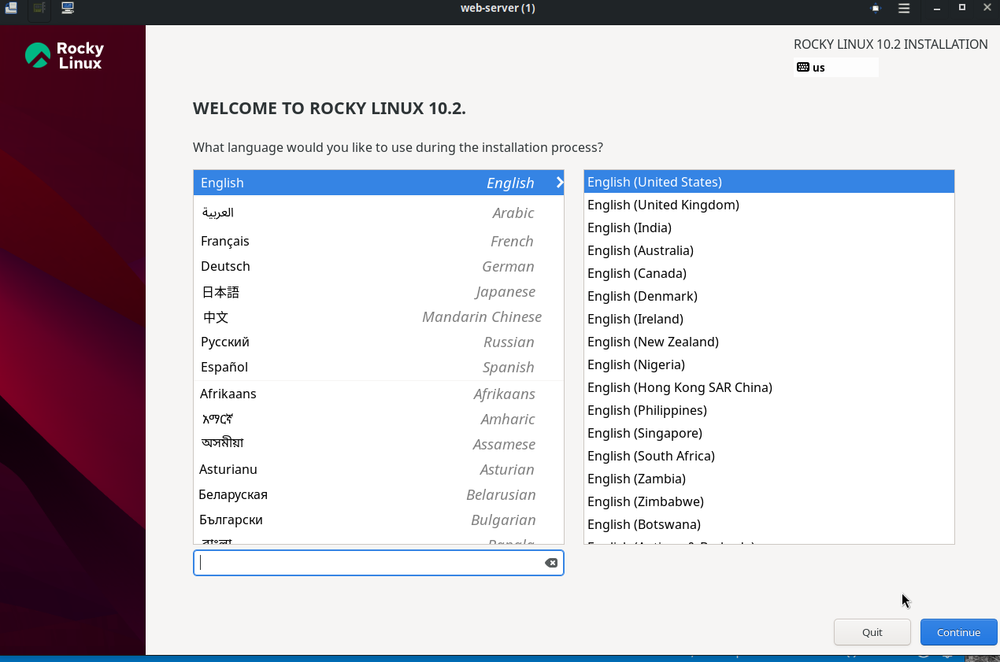

# KVM

## Introduction

KVM is a hypervisor that runs natively on Linux. This example contains a script to start the Rocky 10 graphical installer.

## Pre-requisites

KVM must be configured for your Linux system.

## Steps

First download the ISO for RockyLinux 10 from the cloest mirror at https://rockylinux.org/download and copy it to /var/lib/libvirt/boot.

Next, copy the QCOW2 file for RockyLinux 10 and copy it to KVM storage pool. The script defaults this location to /data/libvirt/default/images.

The latest version of RockyLinux 10 as of this writing is 10.2. If a newer version is available, please update install.sh.

Next, run the install script:

```sh
sh ./install.sh -n web-server -s 30
Creating VM...

Domain 'web-server' has been undefined

Image resized.

Starting install...
Creating domain...                                          |         00:00     
Running graphical console command: virt-viewer --connect qemu:///system --wait web-server
```

The graphical installer will be displayed in a separate window.

